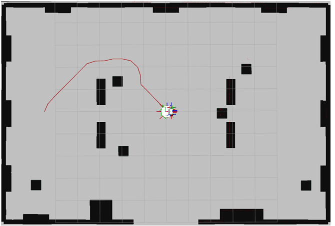
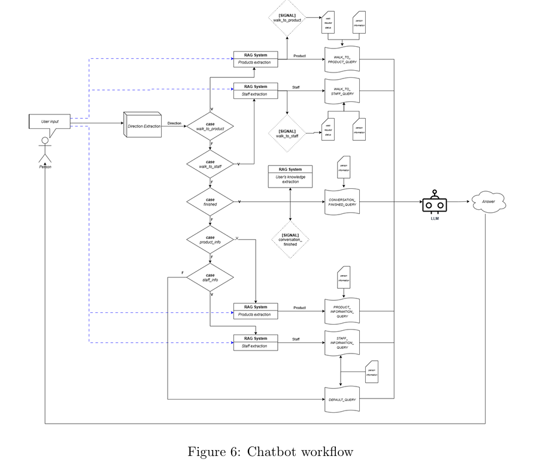
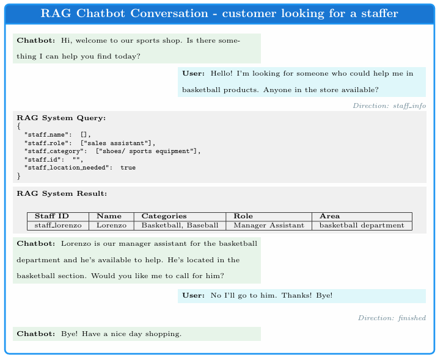
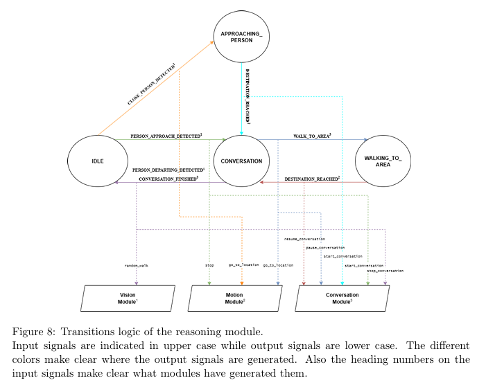

# Tiago Shop Assistant 🇮🇹/🇬🇧

## 🇮🇹 Italiano

**Disclaimer**: applicazione fatta per l'esame di _Elective in AI 2_, nel secondo anno della facoltà magistrale di _AI & Robotics_ di _Sapienza Università di Roma_.  

Questo progetto presenta la progettazione e progrmmazione un **assistente robotico (TIAGo)** progettato per operare in un ambiente di vendita al dettaglio in un negozio sportivo. L'obiettivo principale è migliorare l'esperienza del cliente e l'efficienza del negozio attraverso l'automazione di compiti chiave.
Per la realizzazione di esso sono state utilizzate tecniche di IA combinate con un sistema di decision making e un ambiente di sviluppo robotico.

### Funzionalità Implementate

* **Navigazione Autonoma e Sicura**: TIAGo è in grado di muoversi autonomamente all'interno dell'ambiente del negozio, evitando ostacoli e pianificando percorsi sicuri.
  <div align="center">
    
  </div>
* **Interazione con i Clienti tramite Chatbot**: Un sistema di chatbot integrato consente a TIAGo di comunicare e rispondere alle domande dei clienti.
    <div align="center">
      
    </div>

* **Rilevamento e Tracciamento delle Persone e dei prodotti**: Il robot può identificare e seguire le persone e prodotti nell'ambiente per scopi di assistenza o monitoraggio.
    
* **Assistenza alla Vendita e Informazioni sul Prodotto**: TIAGo può fornire informazioni sui prodotti e guidare i clienti e staffer verso specifiche aree del negozio.
    <div align="center">
      
    </div>
* **Decision making**: in base a stimoli esterni ed un'architettura a stati, TIAGo è capace di prendere decisioni sui vari compiti da svolgere in modo totalmente autonomo.
    <div align="center">
      
    </div>
* **Conoscenze dinamiche integrate con un RAG system**: TIAGo è capace di prendere decisioni e rispondere in base ad una base di conoscenza, e allo stesso tempo è capace di aggiornarla in base agli stimoli esterni e le conversazioni.
  
**Consigliato**: leggere la presentazione per maggiori informazioni.

### Tecnologie Utilizzate

* **ROS 2 (Robot Operating System 2)**: Framework principale per lo sviluppo robotico.
* **Python**: Linguaggio di programmazione versatile per la logica del robot e l'integrazione.
* **Python/PyTorch**: Utilizzato per modelli di Machine Learning, specialmente per il rilevamento delle persone e potenzialmente per il chatbot.
* **Python/OpenCV**: Libreria per la visione artificiale, essenziale per il rilevamento e tracciamento delle persone.
* **Python/SentenceTransformer**: Libreria utilizzata per la creazione di embeddings del testo per la creazione di un RAG system.
* **Gazebo**: Simulatore di robotica per test e sviluppo in ambiente virtuale.
* **RViz**: Strumento di visualizzazione 3D per ROS.
* **Llama3.1-Instruct**: LLM utilizzato per la knowledge extraction e il chatbot.

---

## 🇬🇧 English

**Disclaimer**: This application was developed for the _Elective in AI 2_ exam, during the second year of the Master's degree in _AI & Robotics_ at _Sapienza University of Rome_.

This project presents the design and development of a **robotic assistant (TIAGo)** intended to operate in a retail environment within a sports shop. The main goal is to enhance customer experience and store efficiency through the automation of key tasks.  
The implementation leverages AI techniques combined with a decision-making system and a robotic development framework.

### Implemented Features

* **Autonomous and Safe Navigation**: TIAGo is capable of moving autonomously within the shop environment, avoiding obstacles and planning safe routes.
  <div align="center">
    
  </div>
* **Customer Interaction via Chatbot**: An integrated chatbot system enables TIAGo to communicate and respond to customer inquiries.
    <div align="center">
      
    </div>

* **People and Product Detection & Tracking**: The robot can identify and follow people and products within the environment for assistance or monitoring purposes.
    
* **Sales Assistance and Product Information**: TIAGo can provide product information and guide both customers and staff to specific areas of the shop.
    <div align="center">
      
    </div>
* **Decision Making**: Based on external stimuli and a state-machine architecture, TIAGo can autonomously make decisions regarding which tasks to perform.
    <div align="center">
      
    </div>
* **Dynamic Knowledge with a RAG System**: TIAGo is capable of making decisions and answering based on a knowledge base, while also updating this knowledge dynamically based on external stimuli and conversations.

**Recommended**: See the presentation for more information.

### Technologies Used

* **ROS 2 (Robot Operating System 2)**: Main framework for robotic development.
* **Python**: Versatile programming language for robot logic and integration.
* **Python/PyTorch**: Used for machine learning models, especially for people detection and potentially the chatbot.
* **Python/OpenCV**: Computer vision library, essential for detecting and tracking people.
* **Python/SentenceTransformer**: Library used to create text embeddings for building a RAG system.
* **Gazebo**: Robotics simulator for testing and development in a virtual environment.
* **RViz**: 3D visualisation tool for ROS.
* **Llama3.1-Instruct**: LLM used for knowledge extraction and the chatbot.


## ROS 2 Workspace – Node and Service Generator

This is a ROS 2 workspace with helper scripts to quickly create Python-based nodes and services. It includes example scripts to create and remove nodes/services dynamically, a setup script, and an automatic runner script.

---

### 📋 System Requirements

- **Ubuntu 22.04.5 LTS (Jammy Jellyfish)**
- **ROS 2 Humble Hawksbill**
- **Python 3.10.12**

---

### 🗂 Project Structure

```
ros2_ws/
├── src/                      # ROS 2 packages go here
├── create_node.py           # Script to generate a ROS 2 Python node
├── create_service.py        # Script to generate a ROS 2 Python service
├── remove_node.py           # Script to delete a previously created node
├── remove_service.py        # Script to delete a previously created service
├── start_project.bash       # Setup script (e.g., for sourcing env and creating base structure)
├── run.bash                 # 🔁 Script that builds and runs all nodes automatically
├── build/                   # Build artifacts (ignored by Git)
├── install/                 # Install tree (ignored by Git)
├── log/                     # Colcon logs (ignored by Git)
└── .gitignore               # Git ignore rules
```

---

### 🚀 Getting Started

#### 1. Clone the Repository

```bash
git clone git@github.com:federicomatarante/ros2_ws.git
cd ros2_ws
```

#### 2. Source ROS 2 Humble Environment

```bash
source /opt/ros/humble/setup.bash
```

> 💡 Make sure ROS 2 Humble is installed. You can follow the official guide: https://docs.ros.org/en/humble/Installation.html

### 3. Run the Project Setup Script

```bash
bash start_project.bash
```

This script can automatically set up folders, permissions, and any default structure you want.

---

### ⚙️ Building the Workspace

```bash
colcon build
```

After building, source the local workspace:

```bash
source install/setup.bash
```

Or simply:

```bash
. install/setup.bash
```

---

## 🧱 Creating a Node

To generate a new node:

```bash
python3 create_node.py <package_nam> <node_name> <executable_name>
```

---

###🧩 Creating a Service

To generate a new service:

```bash
python3 create_service.py  <package_nam> <service_name>
```

---

### 🗑 Removing a Node or Service

```bash
python3 remove_node.py  <package_nam> <node_name> <executable_name>
python3 remove_service.py  <package_nam> <service_name>
```

These scripts clean up any auto-generated files or references.

---

### ▶️ Running a Node

Manually:

```bash
ros2 run <package_name> <executable_name>
```

Example:

```bash
ros2 run my_package my_node
```

✅ **OR use the auto-run script**:

```bash
bash run.bash
```

This script:
- Sources ROS 2 and the workspace
- Builds the workspace
- Launches all configured nodes automatically

---

### 📦 Notes

- All scripts assume a typical ROS 2 Python package structure.
- You can customize `create_node.py` and `create_service.py` to fit your preferred code template.
- Update `run.bash` to launch only the nodes you want, using `ros2 run` or a `ros2 launch` command.

---

### 📝 License

MIT License. See `LICENSE` for details.
